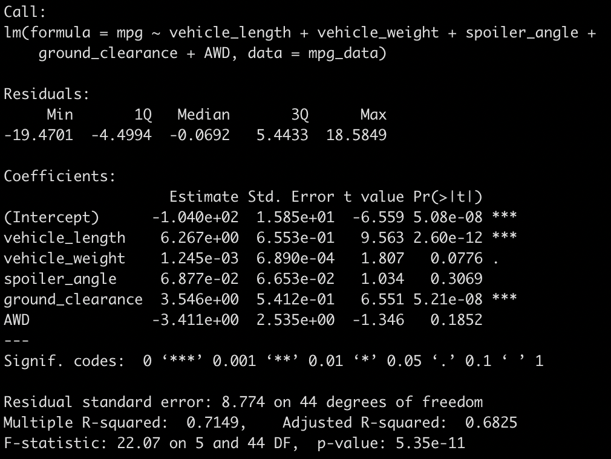
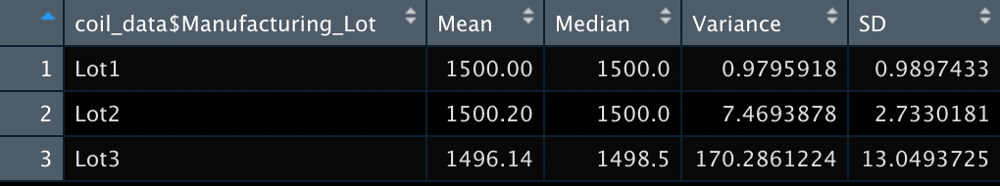
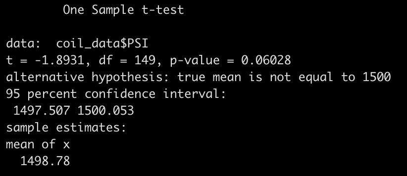
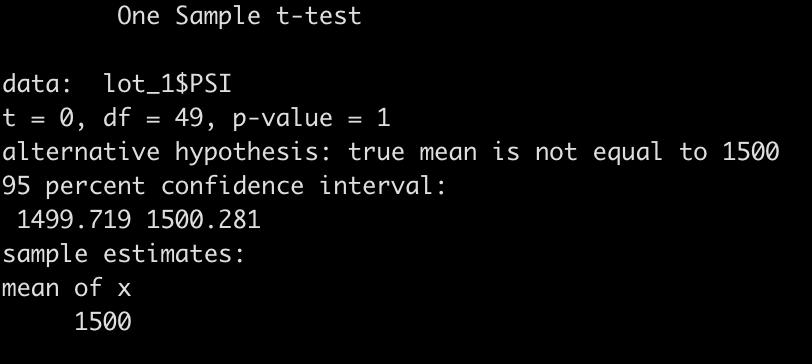
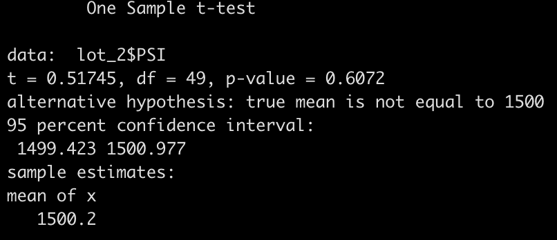
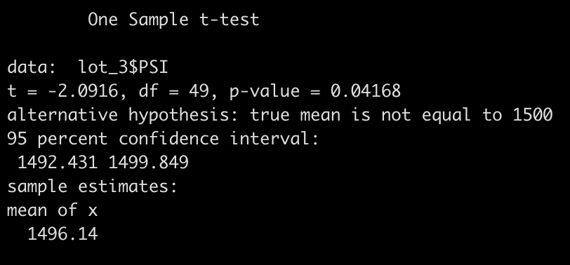

# MechaCar Statistical Analysis

The following is a statistical analysis of several aspects of the production for AutoRUs' new MechaCar using R. 

## Linear Regression to Predict MPG

A multiple linear progression was performed to determine which aspects of vehicle design (vehicle length, vehicle weight, spoiler angle, ground clearance, and AWD), if any, can be used to predict miles per gallon. With an r-squared value of 0.7149, roughly 71.5% percent of mpg predictions made using this model will be correct. The slope of the linear model cannot be considered zero, as the p-value was shown to be 5.35e-11. As shown in the table below, vehicle length (p-value 2.60e-12) and ground clearance (p-value 5.21e-08) provide a non-random amount of variance to the mpg values recorded in the dataset. It can also be seen that the intercept is also statistically significant (p-value 5.08e-08), indicating that there are other factors influencing mpg that are not included in this analysis. This and the lack of significant variables is evidence that the current model may suffer from overfitting, and simpler and more refined models may provide more accurate predictions of future data. 

## Summary Statistics on Suspension Coils

The summary statistics for the PSI of suspension coils across all lots in the dataset is shown below. 

As seen above, the current manufacturing data meet the specification that the variance of the suspension coils must not exceed 100 pounds per square inch, as the variance was shown to be 62.29 psi. When broken down by manufacturing lot however, it can be seen that while Lot 1 and Lot 2 suspension coils meet this criteria, suspension coils from Lot 3 far exceed the acceptable variance (170.29 psi). The summary statistics for PSI broken down by lot is shown below.

## T-Tests on Suspension Coils

One sided t-tests were performed to determine whether the mean psi is statistically similar to the population mean of 1500 psi. For the entire dataset, the mean psi was 1498.78, and with a p-value of 0.06028, the means are statistically similar using the 0.05 confidence interval. When individual t-tests were performed for each manufacturing lot, Lot 1 and 2 were shown to have statistically similar means to the population, while Lot 3 was shown to be statistically different (mean: 1486.14, p-value: 0.04168). The results of all four t-tests are shown below. 

 

## Study Design: MechaCar vs Competition

To determine how the MechaCar may fare against its competition, a multiple linear regression should be performed to determine what aspects of similar cars can be used to model the number of those cars sold. Metrics used as independent variables could be the cost, fuel efficiency, horse power, maintenance cost, and safety rating of the competition's vehicles; the dependent variable could be the number of those cars sold in the past year. Assuming that the null hypothesis is rejected and certain variables are shown to have a non-random effect on the number of cars sold, the model can be used to predict how well the MechaCar may sell based on its own metrics.

